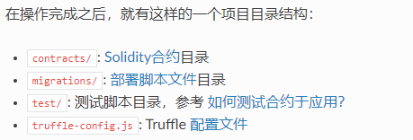

# 安装 Truffle
```shell
npm i truffle -g
```
# 创建项目
```shell
mkdir MetaCoin
cs MetaCoin
truffle unbox metacoin
```
## 成功标志
 > 

# 编译合约
```shell
# 编译最新编写的 *.sol文件
truffle compile
# 编译所有的 *.sol wen文件
truffle compile --all
```
## 编译后的文件位置

